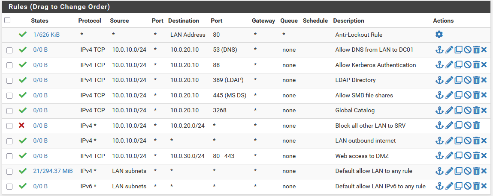
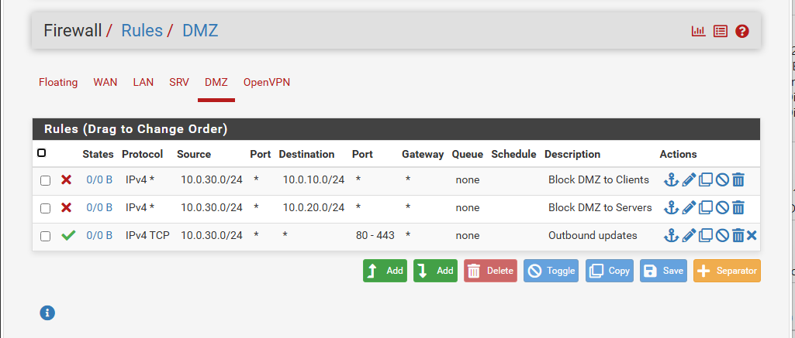
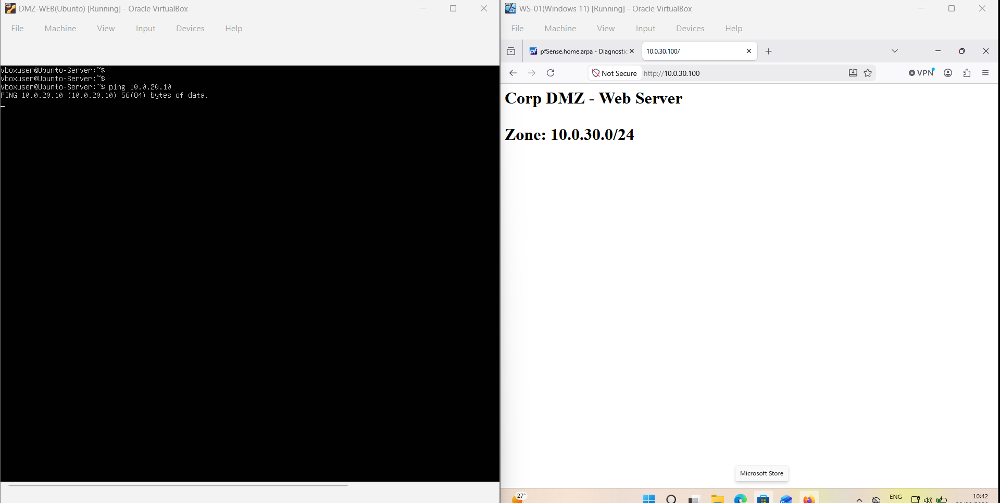
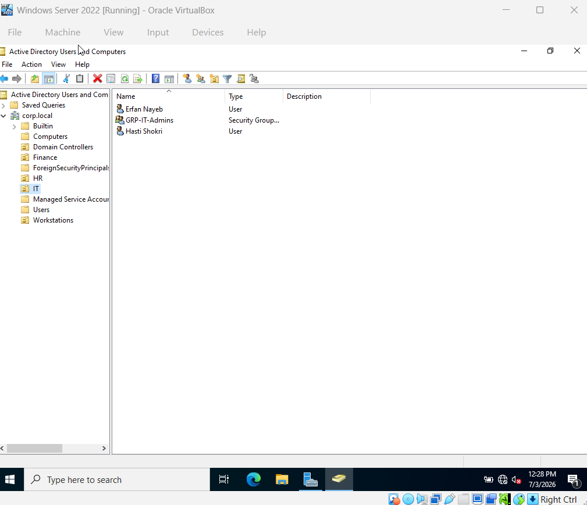
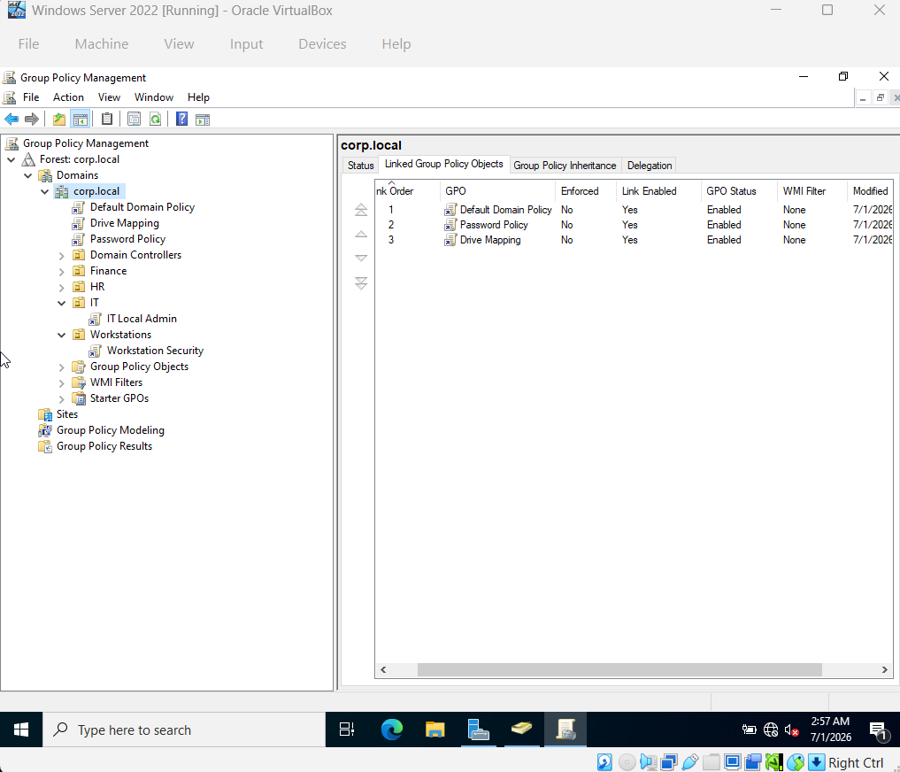
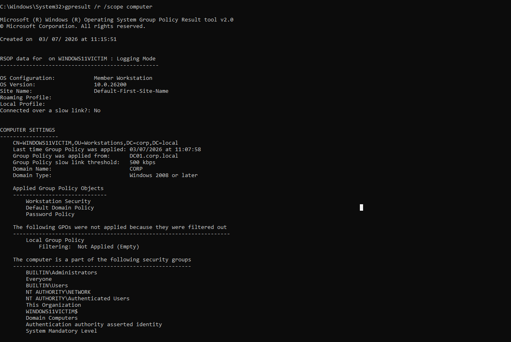
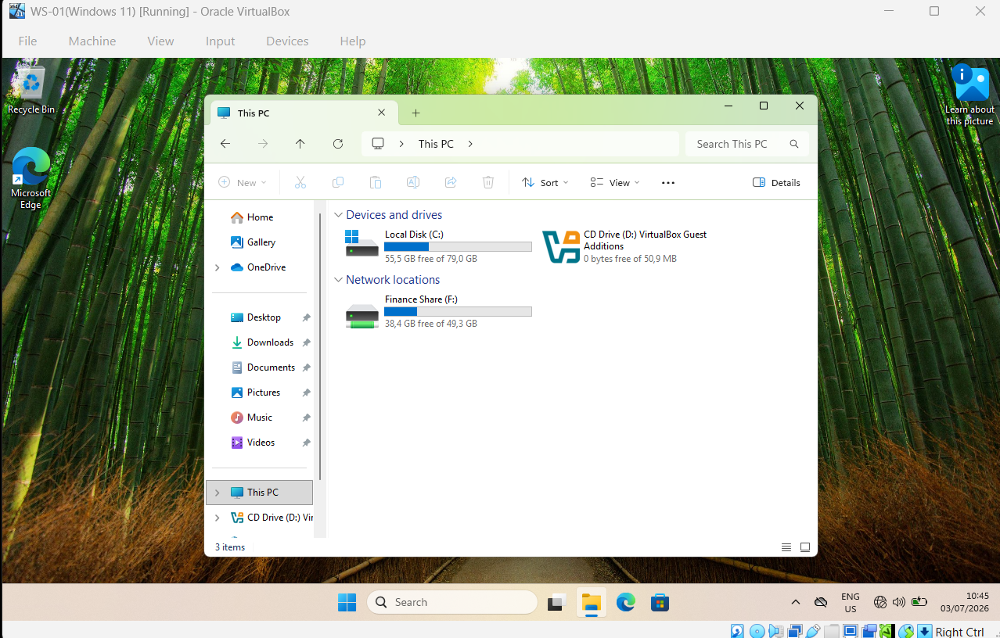
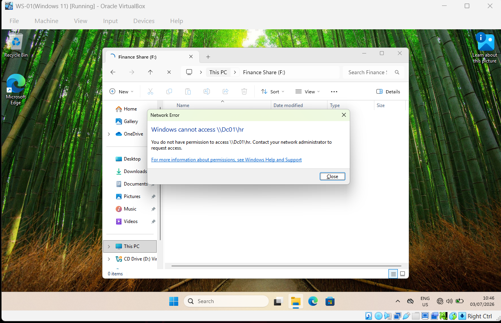

# Small Business Network Infrastructure Lab

A hands-on homelab simulating a real small business IT environment. Built entirely in VirtualBox using pfSense, Windows Server 2022, and Ubuntu Server. Covers network segmentation, firewall policy, Active Directory administration, Group Policy, file services, and remote access.

---

## Architecture

```
                        Internet (NAT)
                              │
                   ┌──────────▼──────────┐
                   │       pfSense        │
                   │  WAN:  DHCP (NAT)   │
                   │  LAN:  10.0.10.1/24 │
                   │  SRV:  10.0.20.1/24 │
                   │  DMZ:  10.0.30.1/24 │
                   └──────┬──────┬───────┘
                          │      │      │
                     VLAN 10  VLAN 20  VLAN 30
                     Clients  Servers   DMZ
                     Win 11   DC01      Ubuntu
                              10.0.20.10 Apache
```

| Zone          | Subnet       | Purpose                            |
| ------------- | ------------ | ---------------------------------- |
| LAN (VLAN 10) | 10.0.10.0/24 | Client workstations                |
| SRV (VLAN 20) | 10.0.20.0/24 | Domain Controller, file services   |
| DMZ (VLAN 30) | 10.0.30.0/24 | Public-facing web server, isolated |

---

## Technologies Used

| Category           | Tools                                          |
| ------------------ | ---------------------------------------------- |
| Firewall / Router  | pfSense CE                                     |
| Directory Services | Windows Server 2022, Active Directory DS       |
| Client OS          | Windows 11                                     |
| DMZ Server         | Ubuntu Server 22.04, Apache2                   |
| Hypervisor         | VirtualBox                                     |
| Protocols          | DHCP, DNS, LDAP, Kerberos, SMB, OpenVPN, IPsec |

---

## Virtual Machines

| VM      | OS                  | IP                                | Role                                |
| ------- | ------------------- | --------------------------------- | ----------------------------------- |
| pfSense | FreeBSD             | 10.0.10.1 / 10.0.20.1 / 10.0.30.1 | Firewall, router, DHCP, VPN         |
| DC01    | Windows Server 2022 | 10.0.20.10                        | Domain Controller, DNS, file server |
| WS-01   | Windows 11          | DHCP (10.0.10.x)                  | Domain-joined client workstation    |
| DMZ-WEB | Ubuntu 22.04        | DHCP (10.0.30.x)                  | Apache web server in DMZ            |

---

## Phase 1 — Network Segmentation and Firewall

### VLAN Design

Three isolated network zones configured as separate interfaces on pfSense:

- **LAN** — client workstations. Can reach SRV on specific ports only.
- **SRV** — servers. Not reachable from DMZ under any circumstance.
- **DMZ** — web server. Reachable from the internet on port 80/443. Blocked from reaching LAN or SRV.

All four interfaces confirmed active with correct IPs:


### Firewall Ruleset

Deny-by-default posture — all traffic is blocked unless explicitly permitted. Every rule includes a comment explaining its purpose.

```
# LAN → SRV (minimum ports for domain functionality)
ALLOW TCP  10.0.10.0/24 → 10.0.20.10  port 53    # DNS
ALLOW TCP  10.0.10.0/24 → 10.0.20.10  port 88    # Kerberos
ALLOW TCP  10.0.10.0/24 → 10.0.20.10  port 389   # LDAP
ALLOW TCP  10.0.10.0/24 → 10.0.20.10  port 445   # SMB file shares
ALLOW TCP  10.0.10.0/24 → 10.0.20.10  port 3268  # Global Catalog
BLOCK all other LAN → SRV

# DMZ isolation
BLOCK all  10.0.30.0/24 → 10.0.10.0/24           # DMZ cannot reach clients
BLOCK all  10.0.30.0/24 → 10.0.20.0/24           # DMZ cannot reach servers
ALLOW TCP  10.0.30.0/24 → WAN  port 80,443        # DMZ outbound updates only

# WAN → DMZ (public web access)
ALLOW TCP  any → 10.0.30.x  port 80,443           # Apache web server
BLOCK all other WAN → LAN/SRV
```





### DHCP Configuration

| Interface | Range                      | DNS               |
| --------- | -------------------------- | ----------------- |
| LAN       | 10.0.10.100 – 10.0.10.200  | 10.0.20.10 (DC01) |
| DMZ       | 10.0.30.100 – 10.0.30.150  | 8.8.8.8           |
| SRV       | Disabled — static IPs only | —                 |

### DMZ Web Server

Ubuntu Server with Apache2 deployed in the DMZ zone. Reachable from LAN on port 80 only. Confirmed blocked from reaching internal network on all other ports.



---

## Phase 2 — Active Directory

### Domain

| Setting             | Value               |
| ------------------- | ------------------- |
| Domain              | corp.local          |
| DC hostname         | DC01                |
| DC IP               | 10.0.20.10          |
| Forest/Domain level | Windows Server 2016 |

### Organisational Unit Structure

```
corp.local
├── IT
│   ├── erfan.nayeb   (Erfan Nayeb)
│   └── hasti.shokri  (Hasti Shokri)
├── Finance
│   ├── fin.zare      (Mohammad Zare)
│   └── fin.qosi      (Mehran Qosi)
├── HR
│   └── hr.alipour    (Amirhossein Alipour)
└── Workstations
    └── WINDOWS11VICTIM
```



### Security Groups

| Group         | Members                   | Purpose                            |
| ------------- | ------------------------- | ---------------------------------- |
| GRP-IT-Admins | erfan.nayeb, hasti.shokri | Local admin rights on workstations |
| GRP-Finance   | fin.zare, fin.qosi        | Access to Finance share            |
| GRP-HR        | hr.alipour                | Access to HR share                 |
| GRP-All-Staff | All users                 | Access to Common share             |

### Group Policy Objects

| GPO                  | Linked To                     | Key Settings                                                       |
| -------------------- | ----------------------------- | ------------------------------------------------------------------ |
| Password Policy      | Domain                        | Min 10 chars, complexity on, max 90 days, lockout after 5 attempts |
| Workstation Security | Workstations OU               | Screensaver lock 10 min, USB storage blocked                       |
| Drive Mapping        | Domain (item-level targeting) | IT → I:, Finance → F:, HR → H:                                     |
| IT Local Admin       | IT OU                         | GRP-IT-Admins added to local Administrators group                  |





### File Shares and NTFS Permissions

Shared folders hosted on DC01. Share permissions set to `Everyone: Read` — access enforced at NTFS level.

| Share          | Path              | Group         | NTFS Permission |
| -------------- | ----------------- | ------------- | --------------- |
| \\DC01\IT      | C:\Shares\IT      | GRP-IT-Admins | Full Control    |
| \\DC01\Finance | C:\Shares\Finance | GRP-Finance   | Modify          |
| \\DC01\HR      | C:\Shares\HR      | GRP-HR        | Modify          |
| \\DC01\Common  | C:\Shares\Common  | GRP-All-Staff | Read & Execute  |

Verified: logging in as `fin.zare` grants access to `F:` and denies access to `\\DC01\HR` with an Access Denied error.





---

## Phase 3 — Remote Access

### OpenVPN with Active Directory Authentication

Remote users connect via OpenVPN and authenticate using their Active Directory credentials — no separate VPN password. pfSense authenticates against DC01 over LDAP.

```
Tunnel network:  10.99.0.0/24
Reachable:       10.0.10.0/24 (LAN), 10.0.20.0/24 (SRV)
Auth backend:    LDAP → DC01 (10.0.20.10)
Base DN:         DC=corp,DC=local
```


---

## Key Verifications

```
✓ fin.zare login → F: drive mapped, HR drive access denied
✓ erfan.nayeb login → I: drive mapped, is local admin on workstation
✓ gpresult /r on WS-01 → GPOs listed under Applied GPOs
✓ From DMZ VM: ping 10.0.10.x → blocked by firewall
✓ From LAN: Apache page loads at http://10.0.30.x
✓ OpenVPN connects using AD credentials
✓ Domain users authenticate over VPN tunnel
```

---

## Repository Structure

```
├── README.md
├── docs/
│   ├── network-diagram.png
│   └── screenshots/
│       ├── 01a-pfsense-wan-lan.png
│       ├── 01b-pfsense-srv-dmz.png
│       ├── 02-pfsense-lan-rules.png
│       ├── 03-pfsense-dmz-rules.png
│       ├── 04-apache-and-dmz-blocked.png
│       ├── 05-aduc-ou-tree.png
│       ├── 06-gpo-management.png
│       ├── 07-gpresult-output.png
│       ├── 08a-drive-mapped.png
│       ├── 08b-access-denied.png
│       ├── 09a-vpn-connected.png
│       └── 09b-vpn-ping.png
├── configs/
│   ├── pfsense-config.xml
│   └── gpo-reports/
│       ├── password-policy.html
│       ├── workstation-security.html
│       ├── drive-mapping.html
│       └── it-local-admin.html
```

---

## Skills Demonstrated

- Network segmentation with VLANs and inter-VLAN access control
- Deny-by-default firewall policy design and documentation
- DHCP scope management and DNS forwarding
- NAT, port forwarding, and DMZ architecture
- Active Directory domain deployment and administration
- Organisational Unit design and user/group management
- Group Policy — security baselines, endpoint hardening, preference-based drive mapping
- NTFS permission design and role-based access control
- OpenVPN deployment with LDAP/Active Directory authentication
